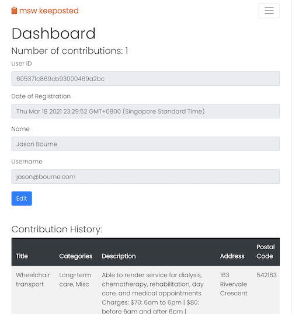
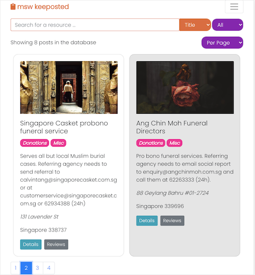
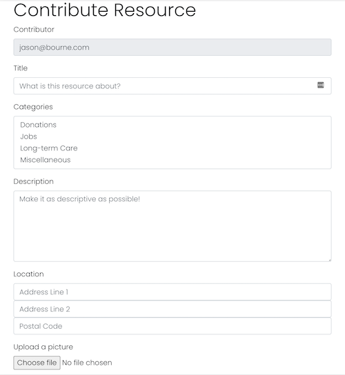
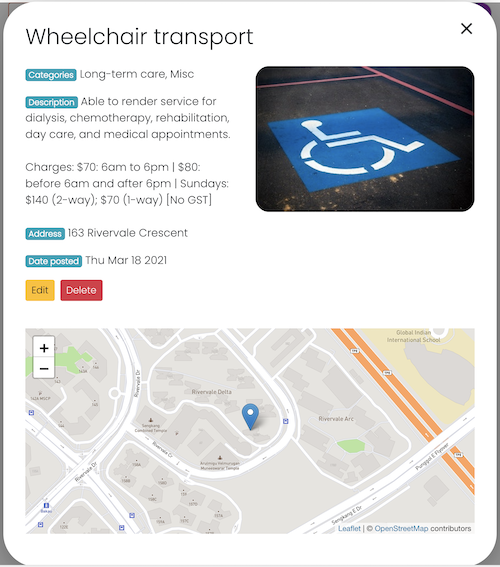
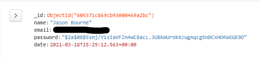

# How to Use

- msw keeposted can be accessed at [https://suspicious-northcutt-d2f899.netlify.app](https://suspicious-northcutt-d2f899.netlify.app)
- Details of the API used for this prototype can be found at [https://github.com/hkgnp/msw-keeposted-api](https://github.com/hkgnp/msw-keeposted-api)
- As this is a prototype, please do not use it for actual services, and do not key in any sensitive patient data.

This app consists of 9 core functions:

1. Dynamic search of various attributes
2. Filter resources by resource category
3. Change number of results per page
4. Post reviews of resources
5. Register / Login / Log out (to contribute resources)
6. Validate forms using joi-browser
7. Hashing of password when sending to MongoDB using bcrypt
8. Contribute / Edit resources and upload a relevant picture
9. User dashboard (to edit your name and email)

# Project Summary

This web application is to be used by Medical Social Workers (MSWs) to contribute resources that may be helpful to their colleagues within or outside their organisation. It is a community driven platform where contributors only need to register to contribute new resources, but registration is not needed to review resources.

# Strategy

It is important for MSWs to be kept updated on the latest health and social care resources that can be used to help patients. Often time, MSWs will need to either maintain their own database of resources, or to frequently ask around whenever their patient needs something that they are not familiar with. Depending on who is asked, there may be different responses. And because the landscape changes quickly, information can get outdated by the time you need it.

This application hopes to be able to create a consolidate pool of updated resources for everyone to reference, and for MSWs to be able to also contribute reviews to keep the data refreshed.

## User Stories

1. As a MSW, I want to be able to look for relevant social and healthcare resources using keywords.
2. As a MSW, I want to be able to contribute new resources that I have come across and provide useful details about them, including upload an image related to the resource (e.g. a flyer).
3. As a MSW, I want to be able to leave reviews of resources that I have used for my patients, to better advise other MSWs who are thinking of using them.
4. As a user, I want to be able to edit the resources that I or my fellow healthcare professionals have contributed.

# Scope

The app must be able to perform the following functions:

- Allow users to employ a variety of search and filter methods to locate the resource they need.
- Allow a user to register, log in and log out.
- Users' passwords must be hashed before storing on the database.
- Allow a user to edit their details on their own dashboard.
- For accountability purposes, to only allow registered users to contribute new resources.
- Allow registered users to edit not only their own contributions, but those of others as well.
- To encourage resources to be vetted as much as possible, allow non-registered users to contribute reviews.
- Each resource should contain critical information, including a map to allow easy location of resource.

# Structure

### Dynamic search

Dynamic search for resources using either the Title, Description, Address or Postal Code. Users can also adjust the number of results that they want to see in one page.

### Filter resources

Filter resources by their category. Users can also adjust the number of results that they want to see in one page.

### Post reviews

Post reviews of resources for other users to decide on the suitability for their patients.

### Register / Login / Log out

Register for an account to contribute or edit resources. User can login and a JWT will be stored on the browser until the user logs out, where it will be deleted.

### User dashboard

Users who have registered and logged in, can access their Dashboard where they can change their display name and username.

### Contribute resource / Edit resource

Registered users can log in to contribute a new resource or edit an existing resource (contributed by themselves or others). They will also be able to upload a picture from their device to provide more details about the resource.

# Skeleton







# Code style

Code is formatted using Prettier (installed as an extension in VS Code).
[](https://github.com/prettier/prettier)

# Deployment

`msw-keeposted` is deployed to Netlify. The API for resources, reviews and user information is hostedon Heroku. MongoDB and Amazon S3 are used for storing text information and images respectively. API details can be found at [https://github.com/hkgnp/msw-keeposted-api](https://github.com/hkgnp/msw-keeposted-api)

### Deploying `msw-keeposted`

After cloning the repository, ensure that the folder and files are in the root directory (e.g. same directory as your .git directory). You may then proceed to log in to your [Netlify](https://www.netlify.com) and deploy a new site from Github. Select your Github directory and Netlify will proceed to deploy your site.

### Deploying `msw-keeposted-api`

After cloning the repository, ensure that the folder and files are in the root directory (e.g. same directory as your .git directory). Using [Heroku's CLI tool](https://devcenter.heroku.com/articles/heroku-cli), proceed to use your terminal to link your repository with Heroku. Before pushing to Heroku (using `git push heroku master` OR `git push heroku <branch>`), ensure that the following is done:

- Your .gitignore file is properly configured to include `node_modules` and any `.env` files.
- A **Procfile** has been created and contains the following: `web: node index.js`.
- The version of Node is included in your `package.json` file:

```
"engines": {
    "node": "14.x"
  }
```

- After creaing the app on Heroku using `heroku create`, set up your **config variables** in the settings section of your application in Heroku. It should contain the variables for the following:
  - S3_ACCESS_KEY (for uploading images to Amazon S3)
  - S3_ACCESS_SECRET (for uploading images to Amazon S3)
  - MONGO_URL (for CRUD in MongoDB)
  - TOKEN_SECRET (for bcrypt to has users' passwords)

For further details, please refer to the awesome [guide](https://devcenter.heroku.com/articles/deploying-nodejs) on Heroku's website.

# Tech/frameworks Used

This app is made only possible thanks to the following technologies:

- [Github](https://www.github.com/)
- [Node](https://nodejs.org/en/)
- [React](https://reactjs.org/)
- [bcrypt](https://www.npmjs.com/package/bcrypt)
- [joi-browser](https://www.npmjs.com/package/joi-browser)
- [reactstrap](https://reactstrap.github.io/)
- [React Router](https://reactrouter.com/)
- [Express](https://expressjs.com/)
- [Leaflet](https://leafletjs.com/)
- [Leaflet Default Icon Compatibility](https://github.com/ghybs/leaflet-defaulticon-compatibility)
- [Bootstrap](https://getbootstrap.com/)
- [Google Fonts](https://fonts.google.com/)
- [Font Awesome](https://fontawesome.com/)
- [MongoDB](https://www.mongodb.com/cloud/atlas)
- [Amazon S3](https://aws.amazon.com/s3/)
- [Heroku](https://www.heroku.com)
- [Axios](https://github.com/axios/axios)
- [Unsplash](https://unsplash.com)
- [bcrypt](https://www.npmjs.com/package/bcrypt)
- [JWT](https://jwt.io/)
- Built with [VS Code](https://code.visualstudio.com/)

# API References

And it is also made only possible thanks to the painstaking work done by the following organisations:

- [OneMap](https://app.swaggerhub.com/apis/onemap-sg/new-onemap-api/1.0.3)
- [Open Street Map](https://www.openstreetmap.org/)
- [Mapbox](https://www.mapbox.com/)

# Acknowledgments

- Mr Paul Chor
- Mr Alexander Yan
- Mr Shun
- Mr Ace Liang
- Mr Christopher Seow
- My wonderful classmates who have been part of this journey together:
  - Hidayah
  - Howard
  - Julius
  - Ryan
  - Ying Ru
- The following guides that helped me understand React further:
  - [To Handle Authentication with Node JS, Express, Mongo, JWT](https://codeburst.io/to-handle-authentication-with-node-js-express-mongo-jwt-7e55f5818181)
  - [Stack Overflow: how to implement Pagination in reactJS](https://stackoverflow.com/questions/40232847/how-to-implement-pagination-in-reactjs)

# Testing

| Category                          | Cases                                                                                                                                       | Expected Outcome                                                                                                                       |
| --------------------------------- | ------------------------------------------------------------------------------------------------------------------------------------------- | -------------------------------------------------------------------------------------------------------------------------------------- |
| Dynamic search                    | 1. Choose attribute from the dropdown list                                                                                                  | Select from options: Title, Description, Address, Postal Code                                                                          |
|                                   | 2. Start typing in the search bar                                                                                                           | Results are dynamically rendered based on the typed string in the search bar                                                           |
| Filter resources                  | 1. Choose filter option from the dropdown list                                                                                              | Select from options: Jobs, Donations, Long-term care, Misc                                                                             |
|                                   | 2.Select filter option                                                                                                                      | Results are filtered according to selected filter option                                                                               |
| Change number of results per page | 1. Choose number from the dropdown list                                                                                                     | The number of results per page will dynamically change depending on number selected                                                    |
| Register                          | 1. Click on 'Sign Up'                                                                                                                       | User is brought to the sign up page                                                                                                    |
|                                   | 2. Complete the sign up form and click sumit                                                                                                | If validation is successful, user will be automatically logged in and brought to the 'All Resources' page                              |
|                                   | 3. Check LocalStorage in the Developer tools                                                                                                | User will see the JSON Web Token that is stored in the LocalStorage                                                                    |
| Login                             | 1. Click on 'Log In'                                                                                                                        | User is brought to the log in page                                                                                                     |
|                                   | 2. Complete the login form and click submit                                                                                                 | If validation is successful, user will be logged in and brought to the 'All Resources' page                                            |
|                                   | 3. Check LocalStorage in the Developer tools                                                                                                | User will see the JSON Web Token that is stored in the LocalStorage                                                                    |
| Form validation                   | 1. While completing forms in **Sign Up**, **Login**, **Contribute Resource** and **Edit Resource** pages, intentionally omit certain fields | Joi-browser will render an error message on the field that needs to be corrected                                                       |
|                                   | Sign Up                                                                                                                                     | Validation is done against whether another registered user shares the same username (email address)                                    |
|                                   | Login                                                                                                                                       | Validation is done against whether the username exists, or whether the entered password is correct                                     |
|                                   | Contribute Resource                                                                                                                         | Validation is done against whether all fields are completed, whether a user is logged in, and if the Postal Code contains 6 characters |
|                                   | Edit Resource                                                                                                                               | Validation is done against whether all fields are completed, whether a user is logged in, and if the Postal Code contains 6 characters |
| Uploading of images               | 1. User selects a file from their device, and uploads it while contributing or editing a resource                                           | Image is successfully uploaded, and is shown on the 'All Resources' page                                                               |
| Post reviews of resources         | 1. Click on the reviews button on a particular resource on the 'All Resources' page                                                         | A modal appears with a list of reviews for the resource                                                                                |
|                                   | 2. User enters their name and review, and clicks submit (please note there is no validation for reviews).                                   | The review, with the user's name and date stamp is rendered almost immediately                                                         |
| Password hashing                  | 1. User registers with a name, username and password                                                                                        | Password is hashed using bcrypt and stored as a hash on MongoDB (refer to screenshot above)                                            |
| User dashboard                    | 1. User clicks on their name in the navigation bar                                                                                          | User is brought to their dashboard, where they are able to view their details, and a history of their resource contributions           |
|                                   | 2. Click edit                                                                                                                               | Name and username fields become editable and user able to input their changes                                                          |
|                                   | 3. Click submit                                                                                                                             | User is brought to the login page where they can log in with their new username                                                        |
